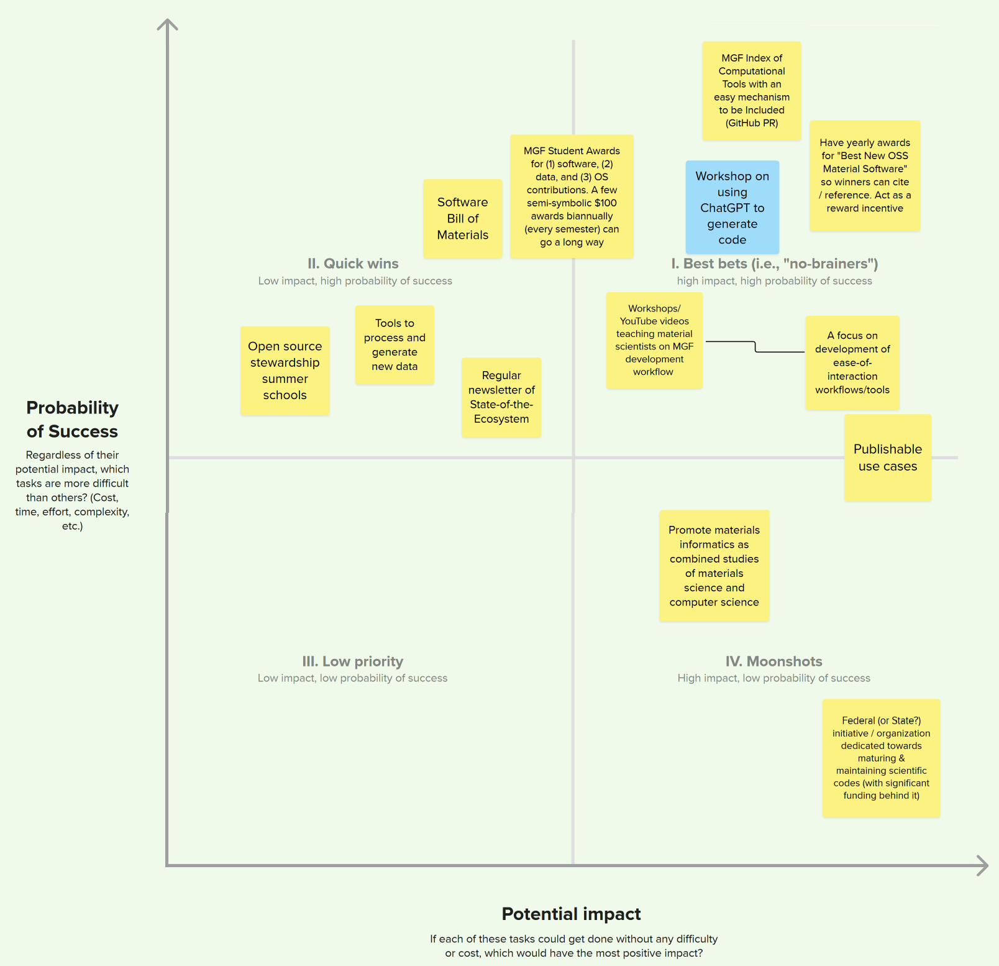
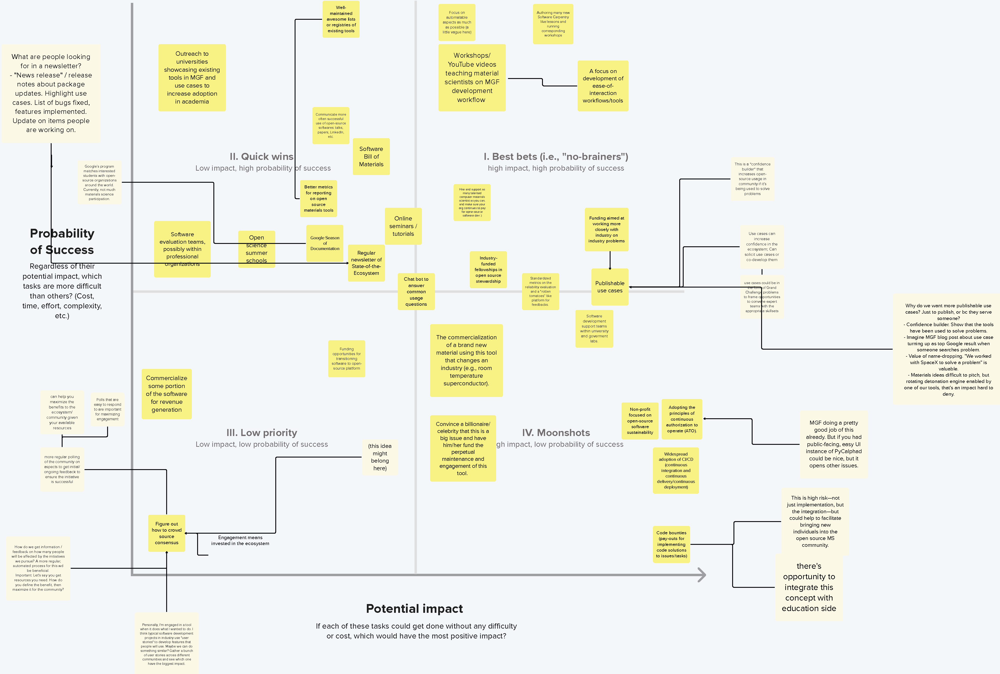
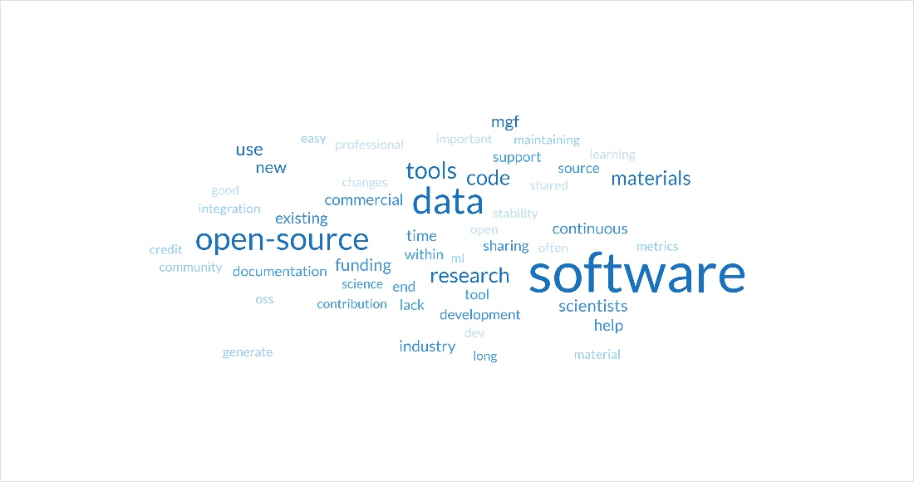

# Materials Genome Foundation: _Strategic Planning Workshops_
# Workshop Summary Results

<!-- we want to introduce nexight somewhere at the top -->

<!-- times -->
<dl>
  <dt>Workshop #1</dt><dd><time>August 17, 12:00 — 2:30pm (ET)</time></dd>
  <dt>Workshop #2</dt><dd><time>August 24, 12:00 — 2:30pm (ET)</time></dd>
  <dt>Location</dt><dd>
  <!-- author location -->
  Pennsylvania State University – University Park 
  201 Old Main 
  University Park, PA 16802
  </dd>
  <dt>Publication Date</dt><dd><time pubdate=pubdate>October 2023</time></dd>
</dl>

<!-- authored data -->

[PDF version](workshops-2023.pdf)

---

## Background

The Materials Genome Foundation (MGF) is a nonprofit organization which promotes computational approaches in science and engineering through organizing workshops and supporting the development of computational tools and databases. With funding from the National Science Foundation’s Pathways to Enable Open-Source Ecosystems (POSE) program, MGF has worked on a strategic plan for its Open-Source Ecosystem for Materials Science (OSEMatS) project. 

In August 2023, the Materials Genome Foundation (MGF) hosted two **Strategic Planning Workshops** with experts and stakeholders in the materials science and open science communities. The purpose of these workshops was to better understand the challenges facing these research and practice communities, ask questions regarding open-source science and software, and ultimately to help MGF **develop a strategic plan** that will meet those needs over the coming years.   

The workshops were facilitated by the [Nexight Group] and took place on [Mural], a digital platform that allows for virtual collaboration through brainstorming tools such as shared whiteboards, digital sticky notes, emoji reactions, and priorities voting. 

**This document is a synthesis of results from both workshops** and will serve as the initial version or basis for a future public-facing report.

## Summary of Key Findings

The following table summarizes the overarching workshop goals and subsequent key/prioritized outputs across both workshops.

### Project Goals

<!-- not a table anymore -->

The following <!--table--> summarizes the overarching workshop goals and subsequent key/prioritized outputs across both workshops.

1. Identify the most **critical issues** limiting the development and acceptance of open-source software tools for materials science
2. Propose **solutions and potential initiatives** to address software sustainability challenges including evaluations of:

    1. **Probability of Success** (low/high)
    2. **Potential Impact** if successful (low/high)

### Priority<!--Critical--> Issues

<dl>
<dt>Data Management & Sharing</dt><dd>

  * Limited ability to securely share in development code 
  * Many software projects are freely shared but not openly accessible
  
  </dd><dt>Data Trust & Model Validity</dt><dd>

  * Model/data provenance 
  * Significant calibration and V&V requirements 
  * Incomplete/unclear software documentation
  
  </dd><dt>Entry & Diffusion Barriers</dt><dd>

  * Incentive to contribute 
  * Credit/attribution needs 
  * Cybersecurity concerns
  
  </dd><dt>Licensing & Commercialization</dt><dd>

  * Pathways to commercialization or robust implementation
  
  </dd><dt>Skills Development & Training</dt><dd>

  * Steep learning curves/time requirements
  
  </dd><dt>Software Quality & Performance</dt><dd>

  * Commercial software outperforms OS counterparts
  
  </dd><dt>Software Support & Maintenance</dt><dd>

  * Sustainability of long term software maintenance 
  * Continuous funding sources 
  * Limited user/technical support
  
  </dd><dt>Workforce & Cultural Barriers</dt><dd>

  * Lack of computational materials science experts 
  * Software development undervalued in traditional research 
  
  </dd>
</dl>

### Solutions & Initiatives

<!-- need to translate the table still -->

## Critical Issues <!--tf--> in Open Materials Science

For the first activity, participants responded to the following focus question:

> What **critical issues** preventing the development and acceptance of open-science software tools are not being adequately addressed by the materials science research community?

Participants were instructed to provide responses and categorize them into 4 initial categories within the visual workspace, Mural: General, Software, Community, and Services. Participants used built-in features of the Mural platform to visually connect ideas, add supplemental information, and give “emoji”-type reactions to ideas.

Participants identified a range of challenges that spanned the following topical focus areas which were identified during post-workshop analysis of the inputs:

* Data Management & Sharing
* Data Trust & Model Validity
* Entry & Diffusion Barriers
* Licensing & Commercialization
* Skills Development & Training
* Software Quality & Performance
* Software Support & Maintenance
* Workforce & Cultural Barriers

### Most Critical Barries<!--Critical Issues-->

Following a group discussion, participants conducted a blind voting session to prioritize the **most critical barriers** in open-science software tool development for the materials science community. For each workshop, the top-voted ideas were used as the basis to frame the subsequent exercise: identifying solutions to overcome these barriers.

The following table contains a list of all barriers identified in both workshops that garnered votes above a certain threshold ([I] for Workshop #1 issues; [II] for Workshop #2 solutions). In some cases, identical ideas with slightly different wordings were provided in both workshop sessions (designated as [III]).

<!-- i think i lost the section marker. we want to use emojis here though -->

<dl>
<dt>Data Management & Sharing</dt><dd>

* No clear solutions for confidentially sharing underdeveloped scientific codes for benefit of other researchers; scientists may not want to invite criticism [III]
  
  > Scientific code can be underdeveloped in ways that are important for sharing (testing, documentation, commented sections, clear variable names), and scientists may not want to open it up to criticism.

* Too many software projects are "quasi-open" (i.e., freely shared by request, but not openly accessible) [I]

</dd>
<dt>Data Trust & Model Validity</dt><dd>

* Machine learning models lack pedigree/provenance of their underlying training data (or are reported without supplemental analyses), limiting both reproducibility and trust [I]
* Open-source tools require significant calibration, verification, and validation to be trusted for use [III]
* Open-source software documentation is frequently unclear or incomplete [II]

</dd>
<dt>Entry & Diffusion Barriers</dt><dd>

* Businesses require more incentives to contribute to open-source projects [I]
* *Some researchers express reluctance to contribute to open-source efforts without certainty they will receive credit or attribution (e.g., citation) from those using their shared data [III]
* Cybersecurity/IT concerns about open tools—especially within industry and government circles [II]

</dd>
<dt>Licensing & Commercialization</dt><dd>

* Unclear how to convert existing research/publications into open-source software products (e.g., converting a programming script/code from a research paper) [I]

    > How do I turn a script I­ made for a paper into an open-source product?

* Unclear how to successfully transition from a research code to robust implementation [II]

</dd>
<dt>Skills Development & Training</dt><dd>

* Open software tools have steep learning curves [II]

</dd>
<dt>Software Quality & Performance</dt><dd>

* Commercially available software (e.g., Vienna Ab initio simulation package [VASP], CALPHAD) outperforms its open-source counterparts [II]

</dd>
<dt>Software Support & Maintenance</dt><dd>

* Difficult to obtain or sustain time and resources for long-term maintenance of open software research tools; Open-source projects lack long-term maintenance strategies which results in large number of software tools that are incompatible or outdated [I]
* Lack of a sustainable, continuous source of funding and research support to maintain and update open software tools [II]
* Limited or lack of user/technical support for open-source software tools [II]

</dd>
<dt>Workforce & Cultural Barriers</dt><dd>

* Research software is often not considered to be a primary output of research, and therefore may not have the same perceived value as traditional research outputs (e.g., publications, citations, licensing) [III]
* Need for more computational materials science experts to support open software tool development efforts [II]

</dd>
</dl>

### Full List of Issues/Barriers

Data Management & Sharing

* **No clear solutions for confidentially sharing underdeveloped scientific codes for benefit of other researchers; scientists may not want to invite criticism** [I]

  > "Scientific code can be underdeveloped in ways that are important for sharing (testing, documentation, commented sections, clear variable names), and scientists may not want to open it up to criticism."

* **Too many software projects are "quasi-open" (i.e., freely shared by request, but not openly accessible)**  [I]
* Lack of a collaborative ML/data analytics platform that learns from disparate proprietary data sources (e.g., across competing organizations) without exposing sensitive information [I]

  > "How can commercial competitors share software/knowhow/data, done in pharma with the Melody program."

* Difficult to get full research/project teams to participate on a common platform (e.g., GitHub) for collaboratively developing software tools [I]

  > “I need my whole team on GitHub”
  
* Need for industry-wide guidelines and education/training resources for instructions on how to record data and metadata; low acceptance rate of existing FAIR data guidelines [I]
* Need for standardized data structures to enable easy sharing (e.g., [HDF] model) [I]

  > Standardization of data structures to enable easy sharing. HDF model. End of OEM tyranny of proprietary file types.”

* Significant redundancies of open-source codes and data repositories [I]

  >  “There are lots of open-source codes and data repositories, and many of them overlap. Are there ways to consolidate?”

* Openly sharing software tools and capabilities instead of keeping them secret can make it more difficult to secure financial support for software development efforts (i.e., funders may want to maintain proprietary nature of software capabilities to gain a competitive advantage) [I]

  > “There can be a unique advantage towards receiving funding for projects if unique software capabilities are kept in-house vs. openly sharing”

* Inadequate availability of platforms for monitoring progress of other research groups working on similar/overlapping efforts (i.e., a metadatabase) [I]

  >  “Inadequate availability of platforms to monitor progress of other research groups working on the same thing - a meta database would be cool”

* Open software tools require significant re-organization of the experimental data and required metadata for the various repositories; May benefit from integration of a large language model to support automation of data organization/management efforts [I]

  >  “Re-organizing experimental data and the required metadata for all the different repositories is time consuming. Perhaps integration of something like ChatGPT (language learning models) could help automate this.”

* > Some researchers do not know where to upload their data to maximize discoverability by other researchers [I]

* Software developers may be unaware of existing tools, leading to redundant or siloed development of tools [II]

Data Trust & Model Validity

* **Machine learning models lack pedigree/provenance of their underlying training data (or are reported without supplemental analyses), limiting both reproducibility and trust** [I]
*	**Open-source tools require significant calibration, verification, and validation to be trusted for use** [III]

  >  “How do I get credit/be cited for data that I have shared”
  
* **Open-source software documentation is frequently unclear or incomplete** [II]
*	Difficult to ascertain trustworthiness of dataset sources [III]
* Significant technical expertise and professional insights are required to check/verify data for accuracy/reliability, making it difficult to quantify the "best value to use" [I]

  >   “Professional insights are required to check/verify data for accuracy/reliability. We need a way to determine the "best value to use". Industry tends to like a single number for property rather than a large range.”

* Process of peer reviewing open research software is unclear [I]
* Difficult to apply standardized approaches for development of open software tools (e.g., benchmarking, validation) that "universally" apply to all open-source software use cases [II]
* Need for metrics for benchmarking and reporting of open-source software tools [II]
* Unclear how to properly validate the reliability of approaches that use AI/ML [II]

Entry & Diffusion Barriers

* Businesses require more incentives to contribute to open-source projects [I]
*	Some researchers express reluctance to contribute to open-source efforts without certainty they will receive credit or attribution (e.g., citation) from those using their shared data [III]

  >  “How do I get credit/be cited for data that I have shared?”

* Cybersecurity/IT concerns about open tools—especially within industry and government circles [II]
* Managers (i.e., decisionmakers) are less likely to approve open-source software if commercial software tools are readily available [II]

  > “If a solution is readily available via commercial software, it is hard to gain management approval to try an open-source solution”

* General concerns about software quality assurance, data reliability, and long-term stability of open-source software [II]
* Open-source tools may not be compatible with regulatory or government requirements (e.g., export controls) [II]

  >  “Unclear how this tool will play nice with regulatory or government requirements (e.g., export control)”

Licensing & Commercialization

* **Unclear how to convert existing research/publications into open-source software products (e.g., converting a programming script/code from a research paper)** [I]

  > “How do I turn a script I made for a paper into an open-source product?”

* **Unclear how to successfully transition from a research code to robust implementation** [II]
* Many universities lack the expertise required to facilitate selection of open-source licenses [I]

Skills Development & Training

* **Open software tools have steep learning curves** [II]
* Lack of easy-to-setup training, workshops, and self-learning modules [I]
* Significant time requirements for learning how to use software tools [II]
* Unsuccessful attempts at using open-source software can deter users from further use [II]

Software Quality & Performance

* **Commercially available software (e.g., Vienna Ab initio simulation package [VASP], CALPHAD) outperforms its open-source counterparts** [I]
* Inability to compete with features and value of commercial software options; commercial users generally require: (1) service contracts, (2) good documentation, and (3) versioning [III]
* Open software tools are typically purpose-built for a specific task or publication, and often not amenable to modifications/applications to new problems [I]

  > “Many tools are purpose-built for a specific task or publication, and it is difficult to modify them for a new problem.”

* Difficult to balance the code of code to the cost of compute (i.e., high-cost code with high efficiency and low compute cost versus less-developed code with higher compute cost) [I]

  >  “Must compare cost of compute to cost of the code”

* Difficult to optimize runtime environments in cloud computing [I]

  > “Run time especially important in cloud computing”

Software Support & Maintenance

* **Difficult to obtain or sustain time and resources for long-term maintenance of open software research tools; Open-source projects lack long-term maintenance strategies which results in large number of software tools that are incompatible or outdated** [I]

  >  “No resources for maintaining software. Open software research tools tend to be chine products with small user/developer based. Hard to dedicate time”; “Long tail of unmaintained research software with no sustainability plan”

* **Lack of a sustainable, continuous source of funding and research support to maintain and update open software tools** [II]

  >  “Who pays for them? Need for continuous support for code maintenance and update (student-wise and financial-wise)”

* **Limited or lack of user/technical support for open-source software tools** [II]

  >  “If I adopt open-source software, who returns my emails when I have questions?”

* Difficult to ensure maturity/stability in open-source software compared with existing commercial tools (e.g., ensuring that open-source code are up-to-date with state-of-the-art methods) [I]
* Support for open-source software is usually less useful/reliable as their commercial counterparts [I]
* Need for community agreement on critical functionalities of open science software tools to reduce the maintenance requirements in making major modifications/updates to software [II]
* Fundamental changes made by team members to open-source software can significantly extend overall development time [II]
* Inability to receive support for open tools [II]
* Uncertainty on long-term maintenance plans for software developed through graduate student projects [II]
* Difficult to define the level of effort required for an open-source software product to become sustainable [II]
* Uncertainty on the development and long-term maintenance of student-driven software expertise [II]
* Lack of frameworks or approaches to manage, maintain, and assure quality of open software tools [II]

Workforce & Cultural Barriers

* **Research software is often not considered to be a primary output of research, and therefore may not have the same perceived value as traditional research outputs (e.g., publications, citations, licensing)** [III]

  >  “Research software is not valued as a research contribution by peers of funding agencies; For scientists, the tools are a means to an end, not the end in themselves; The end goal is often not the software (e.g., manuscript, degree, new materials process).”

* **Need for more computational materials science experts to support open software tool development efforts** [II]
* Cultural mismatch between traditional code development and more modern, generous use of open-source libraries [I]
* Scientists contributing to open software development requires the skillsets held by software engineers [I]

  > "Scientists != software engineers"

* Unclear how to communicate the concepts of accuracy, stability, and usability to community members who aren't intimately familiar with a particular software code [II]
* Need for clarity on how open-source software can mediate professional differences of opinion [II]

  >  “How will this tool mediate professional differences of opinion, if at all?”

* Proper use of open software tools requires substantial expertise in both software engineering and materials science domain knowledge (e.g., physics-based theories) [II]

  >  “Knowledge behind a theory (physics) of a problem is often as important as good software to prevent "wrong" use of the software”

Other (Solution)

* Low stringency requirements for publishing raw data (e.g., in journal submissions) [I]

  >  “Make funders require raw publishing.”

## Solutions and Initiatives

For the second workshop activity, participants used the prioritized list of critical issues as the baseline for responding to the focus question: 

> What solutions or initiatives (MGF or non-MGF) are needed to help overcome key adoption barriers limiting the acceptance of open-science software tools or open-science practices?”

Participants were asked to compose their ideas and place them on a 2x2 grid based on their evaluation of two metrics: the probability that the solution will successfully address key barriers, and the potential impact if those solutions are ultimately successful. The proposed solutions and initiatives were not exclusively limited to the scope of MGF.

The grid comprised the following quadrants:

1. Best Bets—High impact, high probability of success
1. Quick Wins—Low impact, high probability of success
1. Low Priority—Low impact, low probability of success 
1. Moonshots—High impact, low probability of success

Following an initial brainstorming session, participants engaged in a full-group discussion of the mapped solutions beginning with Quadrant I. Participants were unrestricted from moving ideas to different grid locations.

The activity concluded with a blind voting exercise to prioritize the list of proposed solutions and initiatives for addressing the key barriers limiting the acceptance of open-science software tools and practices across Quadrants I, II, and IV (Best Bests, Quick Wins, and Moonshots, respectively).

Participants identified a range of solutions and initiatives that spanned the following topical focus areas which were identified during post-workshop analysis of the inputs:

* Awareness-Building & Recognition
* Commercialization of Open-Source Products
* Community Building & Engagement
* Enabling Tools & Infrastructure
* Experiential Learning & Curricula
* Metrics & Benchmarking
* Resource Allocation Considerations
* Software Development Standards & Best Practices
* Workshops & Training Tutorials

### High-Priority Solutions

The following table lists the solutions proposed in both workshops that received the highest number of votes above a certain threshold (§ for Workshop #1 issues; ¨ for Workshop #2 solutions). Coincidentally, some of proposed solutions across workshops were identical in nature and were subsequently combined in the table (designated as “§/¨”).

<ol>
<li><h4>Best Bets ↑Impact   ↑Success </h4>
  <dl>
  <dt>Awareness-Building & Recognition</dt><dd>
      
  * Create an annual award to recognize materials scientists who have made extraordinary contributions to the development of open software tools and methods (e.g., "Best New OSS Material Software"); Engage with key journal publications on computational materials science to host award program
  * Identify a collection of "publishable use cases" to increase awareness and visibility of the impact of using open-source software (e.g., to solve Grand Challenge programs)

  </dd>
  <dt>Enabling Tools & Infrastructure</dt><dd>
      
  * Increase support for tools for development of open software packages (e.g., workflow automation, optimization of existing tools, software-to-software interoperability tools)
  * Support development of open workflows/tools focused on ease-of-interaction
Metrics & Benchmarking
  * Establish an MGF system (e.g., metadatabase) that hosts an index of open computational tools and includes a mechanism to participate (i.e., similar to GitHub "pull requests")
  
  </dd>
  <dt>Workshops & Training Tutorials</dt><dd>
      
  * Host workshop(s) that teach users how to use LLMs (e.g., ChatGPT) to generate code for open software tools
  
  </dd>
  </dl></li>
<li>
<h4>Quick Wins ↓Impact   ↑Success</h4>
<dl>
<dt>Awareness-Building & Recognition</dt><dd>

* Establish an award program to recognize students on a periodic basis (e.g., each semester) who make significant academic contributions to MGF efforts (e.g., to development of open software and/or data)
* Establish a newsletter for the open science materials science software community (e.g., "State-of-the-Ecosystem"; "MGF Software and Data Weekly Newsletter")

</dd><dt>Enabling Tools & Infrastructure</dt><dd>

* Develop tools for processing and generating new datasets
  
</dd><dt>Experiential Learning & Curricula</dt><dd>

* Increase student learning opportunities through open science/open-source stewardship summer schools

</dd><dt>Software Development Standards & Best Practices</dt><dd>

* Create a "Software Bill of Materials" (SBOM) to solidify common attributes of open software tools
  
</dd>
</dl>
</li>
<li><b>Low Priority ↓Impact   ↓Success</b></li>
<li>
<h4>Moonshots ↑Impact   ↓Success </h4>
<dl>
<dt>Awareness-Building & Recognition</dt><dd>

* Promote materials informatics as a new, legitimate discipline that combines the materials science and computer science fields

</dd>
<dt>Resource Allocation Considerations</dt><dd>

* Foster Federal or State initiative(s) or funding opportunities dedicated to long-term maturation and maintenance of open scientific codes

</dd>
</dl>
</li>
</ol>

### Full List of Solutions/Initiatives

Full list of solutions and initiatives for overcoming barriers to the development and acceptance of open-science software tools for materials science.

<ol>
  <li>
  

Best Bets ↑Impact   ↑Success 

  

Awareness-Building & Recognition
 

* Create an annual award to recognize materials scientists who have made extraordinary contributions to the development of software tools and methods (e.g., "Best New OSS Material Software"); Engage with key journal publications on computational materials science to host award program
* Establish a newsletter for the science materials science software community (e.g., "State-of-the-Ecosystem"; "MGF Software and Data Weekly Newsletter")
* Identify a collection of "publishable use cases" to increase awareness and visibility of the impact of using-source software (e.g., to solve Grand Challenge programs) 

<blockquote>

  “Publishable use cases; This is a "confidence builder" that increases open-source usage in community if it’s being used to solve problems; Use cases can increase confidence in the ecosystem; Can solicit use cases or co-develop them; use cases could be in the form of Grand Challenge problems to frame opportunities to convene expert teams with the appropriate skillsets. 
  Why do we want more publishable use cases? Just to publish, or [because] they serve someone?

  - Confidence builder. Show that the tools have been used to solve problems.
  - Imagine MGF blog post about use case turning up as top Google result when someone searches problem.
  - Value of name-dropping. "We worked with SpaceX to solve a problem" is valuable.
  - Materials ideas difficult to pitch, but rotating detonation engine enabled by one of our tools, that's an impact hard to deny.”
  
</blockquote>

Community Building & Engagement

* Increase engagement with-source materials science research communities (e.g., Pymatgen community using Conda-forge)
* Support funding opportunities to increase collaborative software development efforts with industry around solutions to industry-centric issues

Enabling Tools & Infrastructure

* Increase support for tools for development of software packages (e.g., workflow automation, optimization of existing tools, software-to-software interoperability tools)

  > “Metrics database for software maintainers (i.e., to encourage transparency and community engagement)”
  
* Support development of workflows/tools focused on ease-of-interaction
* Build a software package for re-organizing datasets across different/disparate repositories
* Develop a set of standard tools for up-scaling materials science workflows (i.e., similar to current solutions from the general data science community like Dask)

Experiential Learning & Curricula

* Encourage more industry-funded fellowship opportunities to promote-source stewardship
  

Metrics & Benchmarking

* Establish an MGF system (e.g., metadatabase) that hosts an index of computational tools and includes a mechanism to participate (i.e., similar to GitHub "pull requests")

  >  “MGF Student Awards for (1) software, (2) data, and (3) OS contribution. A few semi-symbolic $100 awards biannually (every semester) can go a long way”

* Create a database of metrics for software maintainers

Resource Allocation Considerations

* Engage funding agencies to consider funding conditions or incentives that require or encourage awardees to share their codes and data (e.g., at conclusion of project effort or embargo period)
  

Workshops & Training Tutorials

* Host workshop(s) that teach users how to use LLMs (e.g., ChatGPT) to generate code for open software tools
* Convene workshops and produce public videos (e.g., YouTube) that teach material scientists how to integrate into MGF workflows/activities
* Support efforts to create online video tutorials/lessons and corresponding workshops (e.g., similar to workshops organized by Software Carpentry)
   

  

  </li>
  <li>

Quick Wins ↓Impact   ↑Success

  

Awareness-Building & Recognition

* Establish an award program to recognize students on a periodic basis (e.g., each semester) who make significant academic contributions to MGF efforts (e.g., to development of open software and/or data)i
* Engage universities to showcase MGF's software tools and use cases to increase open software adoption rates by academia

Community Building & Engagement

* Convene software development support teams within universities and government labs
* Convene software evaluation teams—possibly within professional organizations

Enabling Tools & Infrastructure

* Develop tools for processing and generating new datasets

Experiential Learning & Curricula

* Increase student learning opportunities through open science/open-source stewardship summer schools
* Support academia projects that promote transversal skills development (e.g., teamwork, adaptability, problem-solving)
* Increase support for online seminars/tutorials 
* Pursue opportunities with "Google Season of Docs" (i.e., to receive matchmaking support for students and open-source organizations) to increase overall participation by the materials science researchers

  >  “Google Season of Documentation; Google’s program matches interested students with open-source organizations around the world. Currently, not much materials science participation.”

Metrics & Benchmarking

* Convene open research community of materials scientists to establish consensus benchmark datasets/methods
* Develop a metrics system for reporting on open-source materials tools
* Develop and maintain a list or registry of existing open software tools

Software Development Standards & Best Practices

* Create a "Software Bill of Materials" (SBOM) to solidify common attributes of open software tools
* Support training opportunities that train students how to incorporate unit and integration tests with their research software to help improve long-term maintainability 
* Encourage voluntary requirements or mandates to ensure Federally funded research equipment use open-source file formats (e.g., HDF5)
  

  
  
</li>  
  <li>

Low Priority ↓Impact   ↓Success

  

Awareness-Building & Recognition

* Promote a cultural shift to reform citation behavior to recognize contributions to open-source software development

Community Building & Engagement

* Create a crowd-sourcing mechanism to periodically solicit feedback from the materials science software development community

  >  “Figure out how to crowd source consensus; more regular polling of the community on aspects to get initial/ongoing feedback to ensure the initiative is successful; Polls that are easy to respond to are important for maximizing engagement; more regular polling of the community on aspects to get initial/ongoing feedback to ensure the initiative is successful; can help you maximize the benefits to the ecosystem/community given your available resources; How do we get information / feedback on how many people will be affected by the initiatives we pursue? A more regular, automated process for this would be beneficial.
  > Important: Let's say you get resources you need. How do you define the benefit, then maximize it for the community?”
  

Enabling Tools & Infrastructure

* Provide a platform or supporting infrastructure to host open tools and data for the materials science research community

Experiential Learning & Curricula

* Revise engineering program curricula to increase student software development capabilities
* Support residency programs for non-materials software engineers at universities

Resource Allocation Considerations

* Support research projects aimed at improving the quality and competitiveness of open-source codes (e.g., long-term maintenance)

  
  
</li> 
   <li>

Moonshots ↑Impact   ↓Success

Awareness-Building & Recognition

* Promote materials informatics as a new, legitimate discipline that combines the materials science and computer science fields
* Engage with a journal publication to create a requirement for (or encourage the voluntary use of) a separate peer reviewer(s) for journal submissions that include open software and data

Commercialization of Open-Source Products

* Attract funding and support to transition a commercial software product into an open-source model/platforms
* Demonstrate the use of open software tools to commercialize a transformative application of a new material (e.g., room temperature semiconductor)

  > “The commercialization of a brand-new material using this tool that changes an industry (e.g., room temperature semiconductor)”

Community Building & Engagement

* Launch international projects under MGF with parallel organizations to foster diversity-oriented teams around federative project ideas/themes
* Develop a system or platform for offering code bounties to open software developers (i.e., payouts for implementing code solutions to issues/tasks)

  >  “Code bounties (payouts for implementing code solutions to issues/tasks); This is high risk—not just implementation, but the integration—but could help to facilitate bringing new individuals into the open-source MS community.”

Enabling Tools & Infrastructure

* Build open-source AI/ML platform that facilitates application-oriented materials discovery and manufacturing optimization using open-source data and tools; Incorporates secure sharing feature to learn from proprietary data sources without exposing sensitive or confidential information
* Host dedicated open materials standard libraries (e.g., MatPy for handling of materials data)

Metrics & Benchmarking

* Establish a platform of common or standardized metrics to help the open-source research community evaluate the reliability of software/codes

  >  “Standardized metrics on the reliability evaluation and a ‘rotten tomatoes’-like platform for feedback”

Resource Allocation Considerations

* Foster Federal or State initiative(s) or funding opportunities dedicated to long-term maturation and maintenance of open scientific codes
* Encourage allocation of resources toward projects that account for indirect costs of open-source maintenance

Software Development Standards & Best Practices

* Support efforts to develop standardized representations and formats for fundamental data structures (e.g., composition, atomic structure) to improve interoperability across software tools, databases, and programming languages
* Establish best practices for high-value research code development and maintenance based on frameworks of popular open-source software tools (e.g., OpenCFD)
* Promote adoption of principles of "continuous Authority to Operate (cATO)"
* Promote widespread adoption of CI/CD practices (i.e., continuous integration and continuous delivery/continuous deployment)

  

</li> 
 <li>

Neutral (Placed in the center)

Enabling Tools & Infrastructure

* Create a chatbot or LLM tool for answering common usage questions posed by open software developers
  

</li>   
</ol>

## Appendix

### List of Contributors

| Name                   | Affiliation                                                 |
| ---------------------- | ----------------------------------------------------------- |
| Raymundo Arroyave      | Texas A&M University                                        |
| Brandon Bocklund       | Lawrence Livermore National Laboratory                      |
| Gareth Conduit         | University of Cambridge, UK                                 |
| Michael Gao            | National Energy Technology Laboratory                       |
| Jean-Phillipe Harvey   | École Polytechnique de Montréal, Canada                     |
| Jason Hattrick-Simpers | University of Toronto                                       |
| Yong-Jie Hu            | Drexel University                                           |
| Adam Krajewski         | Pennsylvania State University                               |
| Fazal Mahmood          | Phaseshift Technologies                                     |
| Scott McCormack        | University of California, Davis                             |
| Stephen Niezgoda       | Ohio State University                                       |
| Aurélien Perron        | Lawrence Livermore National Laboratory                      |
| Matthew Priddy         | Mississippi State University                                |
| Brodan Richter         | NASA Langley Research Center                                |
| Dongwon Shin           | Oak Ridge National Laboratory                               |
| Sam Sorkin             | QuesTek Innovations LLC                                     |
| Tobias Spitaler        | Montanuniversität Leoben, Austria                           |
| Bo Sundman             | OpenCalphad                                                 |
| Zach Trautt            | National Institute of Standards and Technology              |
| Jim Warren             | National Institute of Standards and Technology              |
| Cheng Xu               | Booz Allen Hamilton                                         |
| Tony Fast              | Materials Genome Foundation                                 |
| Richard Otis           | Materials Genome Foundation                                 |
| Zi-Kui Liu             | Pennsylvania State University / Materials Genome Foundation |
| Cameron Beals          | Nexight Group                                               |
| Ross Brindle           | Nexight Group                                               |
| Jeremiah Forshey       | Nexight Group                                               |
| Jared Kosters          | Nexight Group                                               |
| Andrew Saku            | Nexight Group                                               |

### Critical Issues: Initial Categorization

During the first workshop activity, participants were instructed to provide responses and categorize them into 4 initial categories within the visual workspace, Mural: General, Software, Community, and Services. Participants used built-in features of the Mural platform to visually connect ideas, add supplemental information, and give “emoji”-type reactions to ideas.

The following table presents the priority list of barriers in their original designations during the workshop sessions.

Community

* Difficult to obtain or sustain time and resources for long-term maintenance of open software research tools
* Businesses require more incentives to contribute to open-source projects
* Research software is often not considered to be a primary output of research, and therefore may not have the same perceived value as traditional research outputs (e.g., publications, citations, licensing)
* No clear solutions for confidentially sharing underdeveloped scientific codes for benefit of other researchers; scientists may not want to invite criticism
* Some researchers express reluctance to contribute to open-source efforts without certainty they will receive credit or attribution (e.g., citation) from those using their shared datav
* Need for more computational materials science experts to support open software tool development efforts

Services

* Unclear how to convert existing research/publications into open-source software products (e.g., converting a programming script/code from a research paper)
* Limited or lack of user/technical support for open-source software tools

Software

* Open software tools are typically purpose-built for a specific task or publication, and often not amenable to modifications/applications to new problemsix
* ML models lack pedigree/provenance of their underlying training data (or are reported without supplemental analyses), limiting both reproducibility and trust
* Commercially available software (e.g., Vienna Ab initio simulation package [VASP], CALPHAD) outperforms its open-source counterparts
* Too many software projects are "quasi-open" (i.e., freely shared by request, but not openly accessible)
* Open-source tools require significant calibration, verification, and validation to be trusted for use
* Open-source software documentation is frequently unclear or incomplete
* Open software tools have steep learning curves
* Cybersecurity/IT concerns about open tools—especially within industry and government circles

General

* Open-source projects lack long-term maintenance strategies which results in large number of software tools that are incompatible or outdatedxi
* Lack of a sustainable, continuous source of funding and research support to maintain and update open software tools
* Unclear how to successfully transition from a research code to robust implementation

### Solutions & Initiatives: Mural Plots

The following figures show screenshots of the synthesized Mural workspace outputs from Workshops #1 and #2, respectively, depicting the 2x2 grids used to evaluate the Probability of Success and Potential Impact for each idea proposed in Activity #2.
(Note: These figures are intended to provide a simple visual representation of the real-time workshop activities as some of the text contained within may be illegible. All outputs are synthesized to text and presented in Section 5 of this report.)

<figure>

<figcaption>

Screenshot of the unsynthesized Mural workspace outputs from Workshop #1 depicting the 2x2 grid used to evaluate the Probability of Success and Potential Impact for each idea proposed in Activity #2.

</figcaption>
</figure>
<figure>

<figcaption>

Screenshot of the unsynthesized Mural workspace outputs from Workshop #2 depicting the 2x2 grid used to evaluate the Probability of Success and Potential Impact for each idea proposed in Activity #2. (Screenshot cropped in attempt to enhance clarity.)

</figcaption>
</figure>

### Supplemental Analysis: Word Cloud

The following figure offers a supplemental visual representation of the words that most frequently appear in raw text keyed into the Mural workspace across both workshops and activities.

<figure>

<figcaption>

Word cloud representation of the most frequently used words key into the Mural workspace across both workshops and activities.

</figcaption></figure>